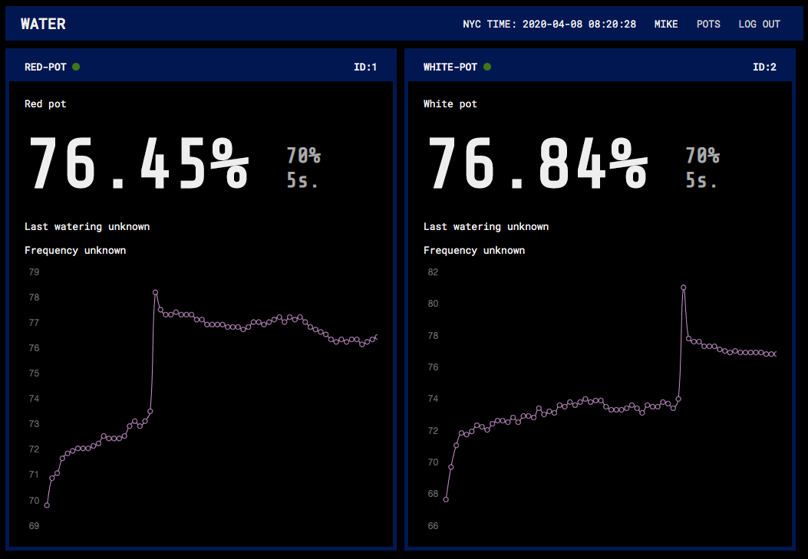
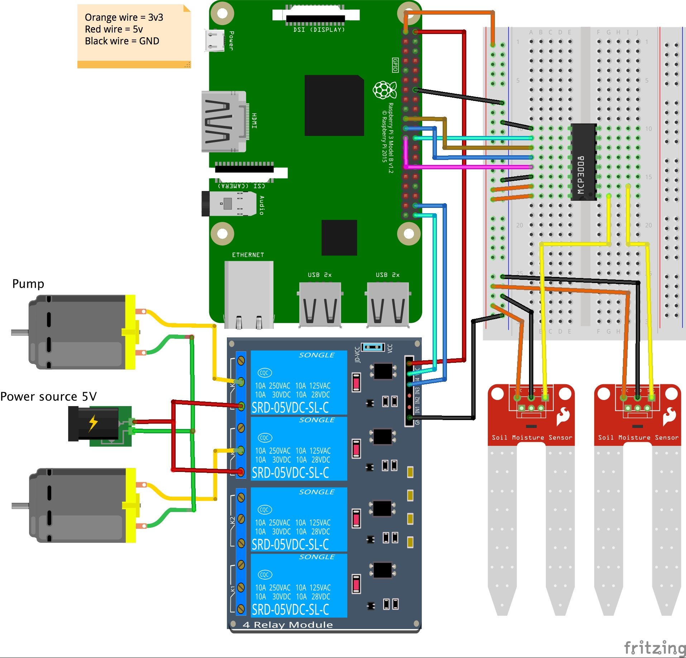

## Automated plant watering system

... that's not only watering plans but also has a cute UI and collects statistics about soil moisture.

My idea was to run a dedicated server with a Zookeeper service and Kafka. 
In case you don't want to use that and UI is not required please take a look at `single_run` directory. 
It has a python script that includes main functionality and that is all you need.

### Components

1. Raspberry Pi 4
2. MCP3008 - 8-Channel 10-Bit ADC With SPI Interface
3. Soil Moisture sensors (i bought two on sparkfun.com)
4. Silicone Tubing for Aquarium (to connect pumps)
5. 5v Relay
6. Submersible Water Pump
7. Wires, breadboards and a power supply (5v) for pumps

### Wiring

### Kafka server settings

server.properties

    listeners=EXTERNAL://:9093,PLAINTEXT://:9092    
    advertised.listeners=EXTERNAL://192.168.0.105:9093,PLAINTEXT://:9092
    listener.security.protocol.map=PLAINTEXT:PLAINTEXT,SSL:SSL,SASL_PLAINTEXT:SASL_PLAINTEXT,SASL_SSL:SASL_SSL,EXTERNAL:PLAINTEXT

### DB

    FLASK_APP=water FLASK_ENV=development flask init-db
    FLASK_APP=water FLASK_ENV=development flask seed-db
    
### Operations (dedicated server)
#### Server
1. Start Zookeeper `make server_zookeeper`
2. Start Kafka `make server_kafka`
3. Start server `make server`
4. Start consumer `make consumer`

#### Client

I installed the code to `/work/water` directory on raspberry pi.

1. Start client `make client`

#### Client's crontub:

    @reboot sleep 15 ; cd /work/water && make client CONFIG=config.json > /work/cron.log 2>&1

### Operations (single run script)
#### Client

1. Start client `python3 single_run.py`

#### Don't forget
to turn on SPI in `sudo raspi-config` for MCP3008 to work properly

### Resources:

This project is based on the following work by other people (many thanks!):

https://gpiozero.readthedocs.io/en/stable/index.html

http://www.cyber-omelette.com/2017/09/automated-plant-watering.html

https://tutorials-raspberrypi.com/measuring-soil-moisture-with-raspberry-pi/
